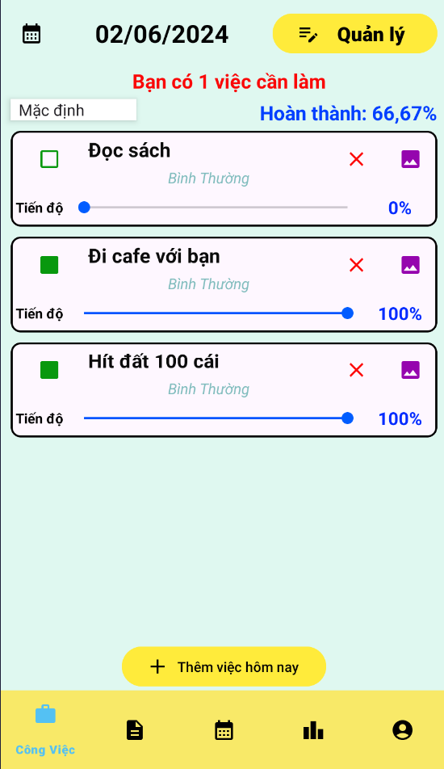
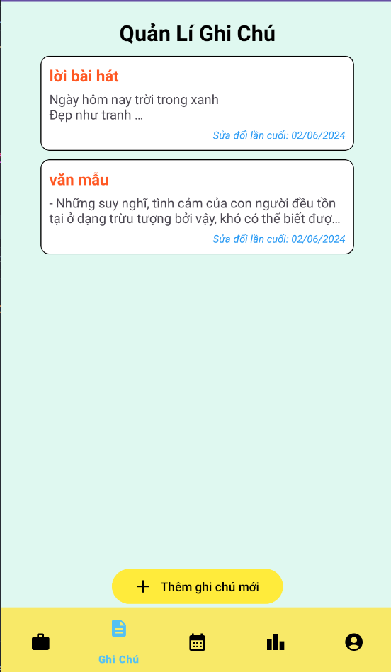
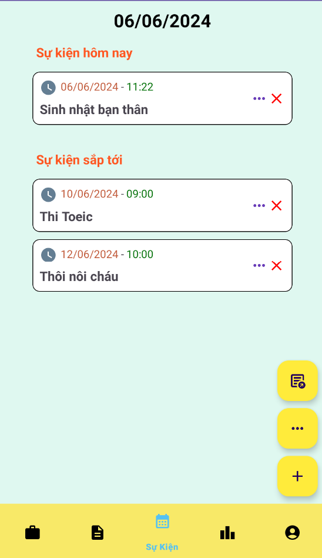

# Task Management App

<h3>Công nghệ sử dụng</h3>
<b>App: </b> Kotlin, MVVM Architecture, BroadcastReceiver, Retrofit, Hilt, View Binding, Navigation, 
Notification, ResfulAPI, Firebase 
 
<b>Database: </b> SQL Server

<h3>Giao diện App</h3>

<h5>Giao diện trang đăng nhập</h5>

<h5>Giao diện trang hiển thị các công việc trong ngày</h5>

Màn hình sẽ hiển thị những công việc được lên lịch trong ngày, có thể quản lí phần trăm tiến độ công việc và up ảnh của công việc đó

<h5>Giao diện trang thêm công việc</h5>

Công việc sẽ bao gồm tiêu đề và nội dung, có thể thiết lập ngày bắt đầu, ngày kết thúc , chu kì lặp lại của công việc (1 lần, hằng ngày, hằng tuần, hằng tháng, hằng năm) và tính chất của công việc (bình thường, quan trọng, rất quan trọng).

<h5>Giao diện trang quản lí công việc</h5>

Màn hình sẽ hiển thị những ngày đã được lên lịch công việc, có thể tạo công việc cho những ngày tiếp theo

<h5>Giao diện trang quản lí ghi chú</h5>

Ghi chú gổm có tiêu đề và nội dung, dùng để lưu lại những thông tin quan trọng.

<h5>Giao diện trang quản lí sự kiện</h5>

Màn hình sẽ hiển thị những sự kiện trong ngày hôm nay mà người dùng đã lưu trước và sự kiện trong 7 ngày tới

<h5>Thông báo của sự kiện đã lên lịch trước</h5>

<h5>Giao diện trang thống kê công việc</h5>

Hiển thị tổng số công việc trong tháng, số công việc đã hoàn thành, chưa hoàn thành và biểu đồ tỉ lệ hoàn thành công việc.
Người dùng có thể xem lại những công việc chưa hoàn thành và xuất file PDF công việc trong khoảng thời gian tự chọn.
